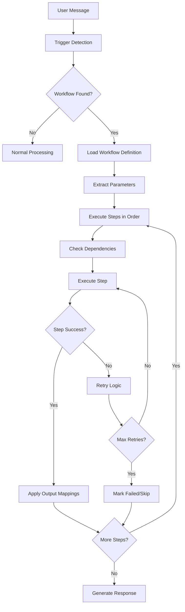

# Cross-Plugin Workflows

This document describes the comprehensive cross-plugin workflow system implemented in the Semantic Kernel POC. This system enables intelligent chaining of operations across different Microsoft 365 services to automate complex business processes.

## Overview

The workflow system automatically detects user intent and executes predefined workflows that span multiple plugins (Calendar, Email, Notes, Meeting Transcripts, etc.). Instead of requiring users to manually chain operations, the AI assistant can now execute complex multi-step processes automatically.

## Architecture

### Core Components

1. **WorkflowOrchestrator** - Central orchestration engine
2. **WorkflowDefinition** - Defines workflow steps and dependencies
3. **WorkflowExecution** - Tracks execution state and results
4. **WorkflowTrigger** - Detects when to execute workflows
5. **Smart Function Selection** - Optimizes function selection for workflows

### Key Features

- **Automatic Trigger Detection** - Recognizes workflow patterns in user messages
- **Dependency Management** - Ensures steps execute in correct order
- **Error Handling & Retry Logic** - Robust execution with exponential backoff
- **Context Passing** - Data flows seamlessly between workflow steps
- **Parallel Execution** - Independent steps can run concurrently
- **Conditional Logic** - Steps can be skipped based on conditions

## Predefined Workflows

### 1. Meeting to Tasks Workflow
**Trigger Keywords**: "meeting tasks", "action items from meeting", "create tasks from meeting", "meeting follow up"

**Steps**:
1. **Get Meeting Transcripts** - Retrieves recent meeting transcripts
2. **Propose Tasks** - AI analyzes transcript and proposes actionable tasks
3. **Create Tasks** - Creates tasks in Microsoft To Do

**Example Usage**: 
- "Create tasks from my recent meeting"
- "Extract action items from meeting"

### 2. Email to Calendar Workflow
**Trigger Keywords**: "schedule from email", "create meeting from email", "email to calendar"

**Steps**:
1. **Search Recent Emails** - Finds emails containing meeting requests
2. **Create Calendar Event** - Extracts details and creates calendar event

**Example Usage**:
- "Schedule a meeting from my recent emails"
- "Create calendar event from email"

### 3. Project Planning Workflow
**Trigger Keywords**: "plan project", "create project plan", "project tasks", "break down project"

**Steps**:
1. **Create Project Note** - Creates a note with project details
2. **Schedule Planning Meeting** - Finds next available time slot
3. **Create Planning Event** - Creates the planning meeting in calendar

**Example Usage**:
- "Plan a new website redesign project"
- "Create project plan for Q1 initiatives"

### 4. Meeting Follow-up Workflow
**Trigger Keywords**: "meeting follow up", "send meeting summary", "meeting recap"

**Steps**:
1. **Get Meeting Transcript** - Retrieves specific meeting transcript
2. **Summarize Meeting** - AI generates meeting summary
3. **Extract Key Decisions** - Identifies important decisions made
4. **Send Follow-up Email** - Sends summary email to attendees

**Example Usage**:
- "Send follow-up for yesterday's meeting"
- "Create meeting recap and email team"

### 5. Weekly Review Workflow
**Trigger Keywords**: "weekly review", "week summary", "weekly report"

**Steps**:
1. **Get Calendar Events** - Retrieves week's calendar events
2. **Get Completed Tasks** - Fetches completed tasks from the week
3. **Create Weekly Summary** - Generates comprehensive weekly note

**Example Usage**:
- "Generate my weekly review"
- "Create summary of this week's activities"

## Workflow Execution Flow



## Technical Implementation

### Workflow Definition Structure

```csharp
public class WorkflowDefinition
{
    public string Id { get; set; }
    public string Name { get; set; }
    public string Description { get; set; }
    public List<WorkflowStep> Steps { get; set; }
    public Dictionary<string, object> DefaultParameters { get; set; }
    public bool IsActive { get; set; }
}

public class WorkflowStep
{
    public string Id { get; set; }
    public int Order { get; set; }
    public string Name { get; set; }
    public string PluginName { get; set; }
    public string FunctionName { get; set; }
    public Dictionary<string, object> Parameters { get; set; }
    public List<string> DependsOn { get; set; }
    public Dictionary<string, string> OutputMappings { get; set; }
    public WorkflowStepCondition? Condition { get; set; }
    public bool IsOptional { get; set; }
    public int MaxRetries { get; set; }
}
```

### Parameter Passing & Context

Workflows use a shared context dictionary to pass data between steps:

- **Input Parameters**: `{{parameterName}}` placeholders are replaced with context values
- **Output Mappings**: Step outputs are mapped to context keys for use by subsequent steps
- **Automatic Extraction**: Common patterns (emails, dates, times) are automatically extracted from user messages

### Error Handling

- **Retry Logic**: Failed steps are retried with exponential backoff
- **Optional Steps**: Steps marked as optional won't fail the entire workflow
- **Graceful Degradation**: Workflows can partially complete if some steps fail
- **Detailed Logging**: Comprehensive execution tracking for debugging

## Benefits

### For Users
- **Simplified Interactions**: Complex multi-step processes become single commands
- **Time Savings**: Automated workflows eliminate manual task chaining
- **Consistency**: Standardized processes ensure nothing is missed
- **Intelligence**: AI understands intent and executes appropriate workflows

### For Developers
- **Extensibility**: Easy to add new workflows and modify existing ones
- **Reusability**: Workflow steps can be reused across different workflows
- **Maintainability**: Clear separation of concerns and modular design
- **Observability**: Detailed execution tracking and performance metrics

## Performance Optimizations

1. **Smart Function Selection**: Only relevant functions are loaded for each workflow
2. **Parallel Execution**: Independent steps can run concurrently
3. **Caching**: Workflow definitions are cached in memory
4. **Lazy Loading**: Steps are only executed when their dependencies are met
5. **Resource Management**: Automatic cleanup of completed executions

## Usage Examples

### Basic Workflow Execution
```
User: "Create tasks from my recent meeting"
System: 🔄 Workflow Executed: Meeting to Tasks
         ✅ Get Meeting Transcripts: Completed (245ms)
         ✅ Propose Tasks from Meeting: Completed (1.2s)
         ✅ Create Tasks: Completed (456ms)
         🎉 Workflow completed successfully!
```

### Workflow with Parameters
```
User: "Plan a website redesign project for Q2"
System: 🔄 Workflow Executed: Project Planning
         ✅ Create Project Note: Completed (123ms)
         ✅ Schedule Planning Meeting: Completed (234ms)
         ✅ Create Planning Event: Completed (345ms)
         📅 Planning meeting scheduled for tomorrow at 2:00 PM
```

## Future Enhancements

### Planned Features
1. **Custom Workflows**: User-defined workflow creation through UI
2. **Conditional Branching**: More complex decision logic in workflows
3. **Scheduled Workflows**: Time-based workflow execution
4. **Workflow Templates**: Pre-built templates for common business processes
5. **Integration Webhooks**: External system integration capabilities

### Advanced Capabilities
1. **Machine Learning**: AI learns from user patterns to suggest new workflows
2. **Approval Workflows**: Multi-step approval processes with notifications
3. **Data Transformation**: Built-in data processing and transformation steps
4. **External APIs**: Integration with third-party services and APIs
5. **Workflow Analytics**: Performance metrics and usage analytics

## Configuration

Workflows are configured in the `WorkflowOrchestrator` class and can be modified to:

- Add new trigger keywords
- Modify step parameters
- Change execution order
- Add conditional logic
- Customize retry behavior

## Monitoring & Debugging

The system provides comprehensive logging and monitoring:

- **Execution Tracking**: Every step is tracked with timing and status
- **Error Reporting**: Detailed error messages and stack traces
- **Performance Metrics**: Execution times and resource usage
- **User Analytics**: Workflow usage patterns and success rates

## Security Considerations

- **User Context**: All operations execute with the authenticated user's permissions
- **Data Privacy**: No sensitive data is logged or cached
- **Access Control**: Workflows respect Microsoft 365 security boundaries
- **Audit Trail**: Complete execution history for compliance requirements

This cross-plugin workflow system transforms the Semantic Kernel POC from a simple function-calling interface into a powerful business process automation platform, enabling users to accomplish complex tasks through natural language interactions. 